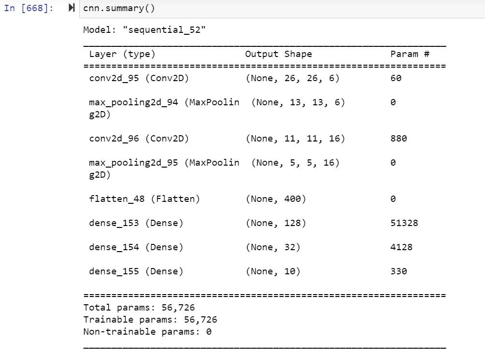

# Classification of MNIST images - Kannada numerals
---
by Annelise Holverstott, Rufus Ayeni, and Anand Ramakrishnan

Nov 11, 2021

General Assembly \\/ Data Science Immersive 

---

## Overview

This project is based on a [Kaggle competition](https://www.kaggle.com/c/Kannada-MNIST/overview) that aims to classify handwritten numerals from the Kannada alphabet. Kannada is a language of India, spoken by over 56 million people, with its own script. [Wikipedia](https://en.wikipedia.org/wiki/Kannada#Writing_system)

## Data

The `train.csv` data consists of 60,000 images of handwritten Kannada numerals 0-9. All classes are perfectly balanced. Each image is 28x28 pixels in grey-scale. For this data set, each of the images has been broken down into 784 pixels with its own column representing its place on the greyscale, from 0-255. The train data also includes a label of which number the image corresponds to. 

There is also a second data set called `Dig-MNIST.csv` from non-native Kannada speakers collected under different conditions from the main data set, which we used to test our model. Because of the difference in quality of the images, this data set is not a good validation data set; 76% accuracy is considered normal for this data. 

To access the data for this project, please [download it via Kaggle.](https://www.kaggle.com/c/Kannada-MNIST/data) 

## Methodology

We used `train_test_split` to divide the training data. All the pixel gradations went into our `X` and were reshaped. The `label` column is our `y`. We converted this from a single column of values 0-9 to 10 categorical, binary columns. 

Convoluted Neural Network (CNN) is the most widely-used approach for classifying image data, and indeed, our best-performing model is a CNN with two sets of convolution and pooling layers, followed by three dense layers. We also used early stopping. Because this is a classification problem, our main metric is accuracy. 

Here is a summary of our best model:

## Analysis and Conclusions

Our model had a training accuracy of 99.6% and a test accuracy of 99.3%. This is much better than the baseline score of 10% per category. 

(When using the alternative data set as test data, our test accuracy was between 71-76%, which is considered a normal result.)

We would recommend this model under similar conditions to the original data. However, when the numbers are a different size, resolution, or written by non-native speakers, accuracy may go down. It would be a good idea to mix up different data sets collected under different conditions to give the model a wider variety of images to train on. 
